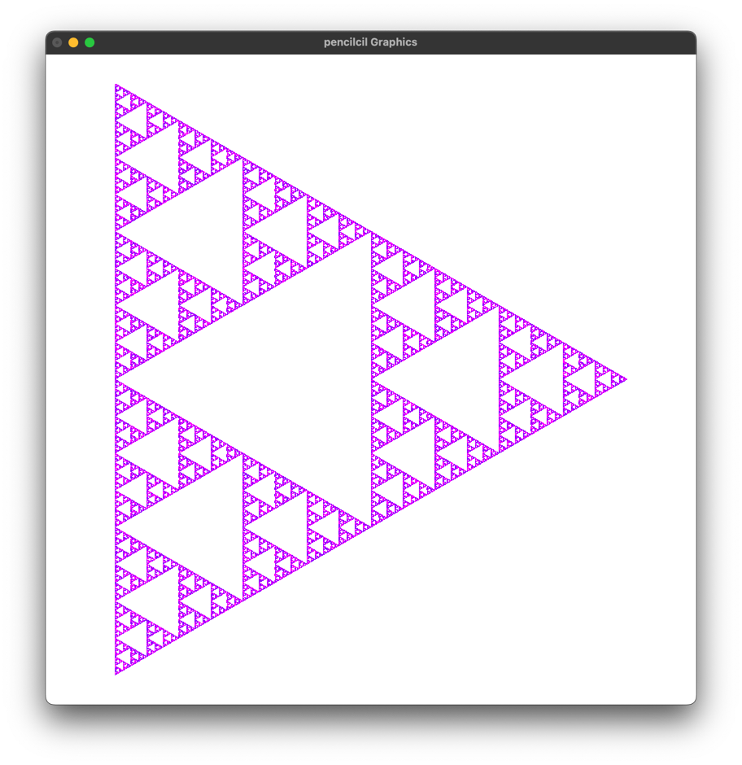

\title{\textbf{%
    John, l’artista\\
    Practica de Programació Funcional}}
\date{Curs 22/23}
\author{Jordi Soler Iglesias, Gerard Sánchez Sáez}
\maketitle

## Prefaci

S'ha creat una `instance Show Comanda` per poder mostrar `Comanda` correctament a la terminal.
```haskell
instance Show Comanda where
  show Para = "Para"
  show (Avanca dist) = "Avanca " ++ show dist
  show (Gira angle)
    | angle < 0 = "Gira (" ++ show angle ++ ")"
    | otherwise = "Gira " ++ show angle
  show (CanviaColor color) = "CanviaColor " ++ show color
  show (Branca comanda) = "Branca (" ++ show comanda ++ ")"
  show (c1 :#: c2) = show c1 ++ " :#: " ++ show c2
```

## Problema 1 
```haskell
separa :: Comanda -> [Comanda]
```
L'objectiu és implementar una funció que prengui una comanda i la descompongui en una llista de comandes més petites, eliminant el constructor "Para". La funció separa crida recursivament a la mateixa funció per a cada comanda individual i retorna la llista concatenada de comandes resultants.

### Extencions / Limitacions

- Assumeix que les comandes estan ben formades sense errors de sintaxi.

### Codi comentat

```haskell
separa :: Comanda -> [Comanda]
separa c = [c]                             -- base -> c -> []
separa (Para) = []                         -- base -> Para = []
separa (c1 :#: c2) = separa c1 ++ separa c2-- descomposició
```
### Implementació

La funció `separa` pren una comanda i la descompon en una llista de comandes més petites.

- Si la comanda és `Para`, retorna una llista buida. 
- Si és de la forma `c1 :#: c2`, crida recursivament a `separa` per a `c1` i `c2`, i concatena les llistes resultants. 
- Per a les comandes individuals, retorna la comanda en una llista. Això permet descompondre les comandes i eliminar el constructor `Para` en la llista de comandes separades.


\pagebreak

## Problema 2

```haskell
ajunta :: [Comanda] -> Comanda
```

El problema resolt consisteix en implementar una funció en Haskell anomenada "ajunta" que pren una llista de comandes i retorna una única comanda que les agrupa totes. La solució utilitza la funció foldr1 per unir les comandes amb l'operador ":#:" i afegeix la comanda "Para" al final.

### Extencions / Limitacions

- La necessitat d'una instància de la classe Show per representar les comandes com a cadenes de caràcters.
- La falta de consideració per les incompatibilitats o conflictes entre les comandes individuals.

### Codi comentat

```haskell
ajunta :: [Comanda] -> Comanda
ajunta [] = Para                        -- base -> [] = Para
ajunta cs = foldr1 (:#:) (cs ++ [Para]) -- composicio foldr1             
```

### Implementacio

La funció "ajunta" pren una llista de comandes i les uneix en una única comanda.
Utilitza la recursió i l'operador ":#:" per unir les comandes de manera successiva. Si la llista és buida, retorna la comanda "Para" que indica el final de la seqüència de comandes.
L'ús de la funció foldr1 ens permet aplicar l'operador ":#:" a tots els elements de la llista, des de l'últim fins al primer, creant així la comanda final que combina totes les comandes originals.


\newpage

## Problema 3

```haskell
prop_equivalent :: Comanda -> Comanda -> Property
```
```haskell
prop_split_join :: Comanda -> Property
```
```haskell
prop_split :: Comanda -> Property
```

L'objectiu principal és verificar si les funcions separa i ajunta són equivalents, és a dir, si aplicar-les successivament a una comanda donada retorna la mateixa comanda original. 

- **prop_split_join:** Verifica que l'aplicació de ajunta a la llista generada per separa d'una comanda sigui igual a la comanda original.
- **prop_equivalent:** Verifica si dues comandes són equivalents. Compara les comandes originals amb les seves llistes separades i ajuntades per determinar si són equivalents.
- **prop_split:** Comprova que la llista generada per separa no contingui cap element de tipus Para ni cap comanda composta (:#:).

### Codi comentat

```haskell
-- Verify that the equality of c1 and c2 is the same as
-- the equality of the lists [c1] and [c2] after applying ajunta
prop_equivalent :: Comanda -> Comanda -> Property
prop_equivalent c1 c2 =
  (c1 == c2) === (ajunta [c1] == ajunta [c2])                         
```
```haskell
-- Verify that applying ajunta to the result of separa on c
-- results in the original c value
prop_split_join :: Comanda -> Property
prop_split_join c = ajunta (separa c) === c                           
```
```haskell
-- Verify that there are no elements in the result of separa c
-- that match the isParaOrConc predicate isParaOrConc
prop_split :: Comanda -> Property
prop_split c =
  not (any isParaOrConc (separa c))
  where
    isParaOrConc Para = True
    isParaOrConc (_ :#: _) = True
    isParaOrConc _ = False                        
```

\pagebreak

### Implementació

Aquest codi conté tres propietats escrites en Haskell per verificar el comportament de les funcions `ajunta` i `separa` en el context del tipus de dades `Comanda`. Les propietats comproven l'equivalència entre comandes, la idempotència de l'operació de separació i ajuntament, i la presència de Para o alguna concatenació en les comandes separades.


\pagebreak

## Problema 4 

```haskell
copia :: Int -> Comanda -> Comanda
```

L'objectiu és la implementació de la funcio ```copia``` que pren un nombre enter i una comanda com a arguments i genera una nova comanda que consisteix en repetir la comanda original un nombre determinat de vegades.

### Extencions / Limitacions

- Afegir la capacitat de modificar les comandes individuals en la llista generada, proporcionant una funcionalitat.

### Codi

```haskell
copia :: Int -> Comanda -> Comanda
copia n c = ajuntaNoPara (replicate n c)
```
```haskell
ajuntaNoPara :: [Comanda] -> Comanda
ajuntaNoPara [] = Para
ajuntaNoPara cs = foldr1 (:#:) cs                           
```

### Implementació

La solució defineix la funció com a ```ajuntaNoPara (replicate n c)```, on ```replicate n c``` crea una llista amb n repeticions de la comanda c, i ```ajuntaNoPara``` concatena totes les comandes de la llista generada en una única comanda (sense el `Para`).


\newpage

## Problema 5 

```haskell
pentagon :: Distancia -> Comanda
```

L'objectiu és generar un pentàgon regular amb costats de la mateixa mida, donada una distància de desplaçament. La funció utilitza la funció auxiliar copia per repetir una seqüència d'ordres un nombre determinat de vegades.

### Extencions / Limitacions

- La solució està fixada per generar un pentàgon regular, no permetent ajustar el nombre de costats o l'angle del gir.

### Codi

```haskell
pentagon :: Distancia -> Comanda
pentagon d = copia 5 (Avanca d :#: Gira 72)              
```

### Implementació

La solució implementada és bastant simple i directa. La funció pentagon rep la distància `d` com a paràmetre i utilitza la funció `copia` per repetir 5 vegades la seqüència d'ordres. 
Aquesta seqüència consisteix en avançar una distància `d` i girar `72` graus a la dreta. 
Això genera el moviment necessari per construir un pentàgon regular.


\newpage

## Problema 6

```haskell
poligon :: Distancia -> Int -> Angle -> Comanda
```
```haskell
prop_poligon_pentagon :: Distancia -> Int -> Angle -> Property
```

L'objectiu és generar un polígon amb un nombre de costats, una longitud i un angle especificats.

### Extencions / Limitacions

- No es realitza cap comprovació per assegurar que l'angle i el nombre de costats coincideixen per formar un polígon vàlid.

### Codi

```haskell
poligon :: Distancia -> Int -> Angle -> Comanda
poligon d l a = copia l (Avanca d :#: Gira a)                              
```
```haskell
prop_poligon_pentagon :: Distancia -> Int -> Angle -> Property
prop_poligon_pentagon d s a = poligon d s a === pentagon d
```

### Implementació

Per construir la comanda que dibuixa el polígon, utilitza la funció ```copia```, i genera una comanda que consisteix en la repetició de la comanda donada. 
Aquesta funció s'utilitza per repetir la seqüència de comandes per avançar i girar.    

Per comprovar l'equivalència, s'utilitza l'operador d'igualtat (`===`) per comparar el resultat de cridar la funció ```poligon``` amb els paràmetres especificats i  el resultat de cridar la funció ```pentagon``` amb el mateix paràmetre de distància. 
Aquest operador de comparació s'encarrega de verificar si els dos resultats són iguals.

\begin{center}
\includegraphics[width=0.95\columnwidth]{poligon.png}
\includegraphics[width=0.95\columnwidth]{prop_poligon.png}
\end{center}
\newpage

## Problema 7

```haskell
espiral :: Distancia -> Int -> Distancia -> Angle -> Comanda
```

L'objectiu és crear un patró d'espiral fent que un llapis es mogui a distàncies cada vegada més llargues o més curtes i girant un angle determinat entre elles.

### Extensions / Limitacions

- Ajustar l'angle de gir després de cada segment, de manera que no sigui un valor fixe sinó una funció o un patró.
- La solució només genera una espiral en sentit horari. Es podria ampliar per permetre l'opció de generar una espiral en sentit antihorari.
- La longitud del primer segment i el pas poden ser nombres negatius, però s'ha de tenir en compte que no es permet una distància de segment negativa, tal com s'especifica en la descripció del problema.

### Codi

```haskell
espiral :: Distancia -> Int -> Distancia -> Angle -> Comanda
espiral len num pas ang = 
  ajuntaNoPara $ zipWith (\i counter 
    -> poligon (len + fromIntegral i * pas) 1 ang) [0..] [1..num]                             
```

### Implementació

S'utilitza la funció ```zipWith``` per combinar dues llistes: una que conté els índexos dels segments de línia (de `0` a ```num```) i una altra que compta els segments de línia des de `1` fins a ```num```. 

A continuació, s'aplica una funció lambda que pren l'índex `i` el comptador creant una comanda de polígon. 
La longitud del polígon es calcula com a ```len + fromIntegral i * pas```, on ```i``` és l'índex i ```pas``` és la quantitat per la qual la longitud dels segments successius canvia. 
L'angle del polígon és el valor fixat ```ang```.  

Finalment, s'utilitza ```ajuntaNoPara``` per concatenar totes les comandes generades en una única seqüència de comandes que descriu l'espiral.


\newpage

## Problema 8

```haskell
execute :: Comanda -> [Ln]
```

L'objectiu és recórrer les comandes de forma recursiva i generar una llista de línies que representin el dibuix resultant. 
Les línies han de ser generades seguint les coordenades i els angles actuals. 

Cada vegada que s'executa una comanda `Avança`, es calcula la nova posició del punt de dibuix utilitzant les funcions trigonomètriques. 
A més, quan es troba una comanda de `Branca`, el conjunt de comandes contingudes a la branca s'executen de manera recursiva.

### Codi

```haskell
execute :: Comanda -> [Ln]
execute c = let c' = ajuntaNoPara (separaAmbPara c)
            in go (marro, Pnt 0 0, 0) c'
  where
    go :: (Llapis, Pnt, Angle) -> Comanda -> [Ln]
    go _ Para = []
    go (pencil, start, angle) (Avanca dist :#: rest) =
      let end = start + Pnt (dist * cos (angle * pi / 180)) 
                            (dist * sin (angle * pi / 180))
      in Ln pencil start end : go (pencil, end, angle) rest
    go (pencil, start, angle) (Avanca dist) =
      let end = start + Pnt (dist * cos (angle * pi / 180)) 
                            (dist * sin (angle * pi / 180))
      in [Ln pencil start end]
    go state@(pencil, start, angle) (Gira newAngle :#: rest) =
      go (pencil, start, angle - newAngle) rest
    go state@(pencil, start, angle) (Gira newAngle) =
      go (pencil, start, angle - newAngle) Para
    go (pencil, start, angle) (CanviaColor newPencil :#: rest) =
      go (newPencil, start, angle) rest
    go (pencil, start, angle) (CanviaColor newPencil) =
      go (newPencil, start, angle) Para
    go state@(pencil, start, angle) (Branca branch :#: rest) =
        let branchLines = go (pencil, start, angle) branch
        in branchLines ++ go state rest
    go state@(pencil, start, angle) (Branca branch) =
        go (pencil, start, angle) branch
    go state@(pencil, start, angle) (_ :#: rest) =
      go state rest
```

### Implementació

```haskell
execute :: Comanda -> [Ln]
execute c = let c' = ajuntaNoPara (separaAmbPara c)
            in go (marro, Pnt 0 0, 0) c'
```

Aquesta és la signatura i l'inici de la funció execute. Pren una `Comanda` i retorna una llista de línies `[Ln]`. 
Abans de cridar la funció `go`, es realitzen algunes transformacions en la comanda d'entrada per simplificar-ne el processament.

A continuació es declara la funció auxiliar `go` amb el seu cas base. 
Pren una tupla que conté el llapis actual, el punt actual i l'angle actual, juntament amb la comanda restant. 
Si la comanda és `Para`, que no fa res, es retorna una llista buida de línies.

```haskell
go :: (Llapis, Pnt, Angle) -> Comanda -> [Ln]
go _ Para = []
```

Aquesta part gestiona el cas en què la comanda és una seqüència de `Avanca` i altres comandes (`Avanca dist :#: rest`).   

Es calcula la nova posició (`end`) del punt de dibuix sumant la distància `dist` en les direccions `x` i `y` utilitzant les funcions trigonomètriques `cos` i `sin`.  

A continuació, s'afegeix una nova línia (`Ln`) a la llista de línies, que representa el segment dibuixat des del punt inicial (`start`) fins al punt final (`end`).
La funció `go` es crida de manera recursiva amb la nova posició i la resta de la comanda.

```haskell
go (pencil, start, angle) (Avanca dist :#: rest) =
  let end = start + Pnt (dist * cos (angle * pi / 180))
                        (dist * sin (angle * pi / 180))
  in Ln pencil start end : go (pencil, end, angle) rest
```

Aquí es gestiona el cas en què la comanda és només un `Avanca` (`Avanca dist`).   
El funcionament és similar a l'anterior, però en aquest cas, es retorna una llista que conté només una línia.

```haskell
go (pencil, start, angle) (Avanca dist) =
  let end = start + Pnt (dist * cos (angle * pi / 180)) 
                        (dist * sin (angle * pi / 180))
  in [Ln pencil start end]
```

Aquesta part gestiona el cas en què la comanda és una seqüència de `Gira` i altres comandes (`Gira newAngle :#: rest`).

Es resta `newAngle` a l'angle (`angle`) actual i es crida la funció `go` de manera recursiva amb l'angle actualitzat i la resta de la comanda.

```haskell
go state@(pencil, start, angle) (Gira newAngle :#: rest) =
  go (pencil, start, angle - newAngle) rest
```
 
Per gestionar el cas en què la comanda és només un `Gira` (`Gira newAngle`), es resta `newAngle` actual a l'angle (`angle`) i es crida la funció `go` de manera recursiva amb l'angle actualitzat i una comanda `Para` per finalitzar la seqüència de comandes.

```haskell
go state@(pencil, start, angle) (Gira newAngle) =
  go (pencil, start, angle - newAngle) Para
```

La clàusula que gestiona el cas en què la comanda és una seqüència de `CanviaColor` i altres comandes (`CanviaColor newPencil :#: rest`) actualitza el llapis actual (`newPencil`) i crida la funció `go` de manera recursiva amb el llapis actualitzat i la resta de la comanda.

```haskell
go state@(pencil, start, angle) (CanviaColor newPencil :#: rest) =
  go (newPencil, start, angle) rest
```

La mateixa clàusula pero per gestionar el cas en què la comanda és només un `CanviaColor` (`CanviaColor newPencil`). S'actualitza el llapis actual (newPencil) i es crida la funció go de manera recursiva amb el llapis actualitzat i una comanda Para per finalitzar la seqüència de comandes.

```haskell
go state@(pencil, start, angle) (CanviaColor newPencil) =
  go (newPencil, start, angle) Para
```

Aquesta part gestiona el cas en què la comanda és una seqüència de `Branca` i altres comandes (`Branca branch :#: rest`), on es crida la funció `go` recursivament per processar la branca de comandes (`branch`) i s'obté una llista de línies que representa el dibuix d'aquesta branca (`branchLines`). 
A continuació, es torna a cridar la funció `go` de manera recursiva amb la resta de la comanda (`rest`) i s'afegeixen les línies de la branca (`branchLines`) a la llista de línies generada per la resta de la comanda.

```haskell
go state@(pencil, start, angle) (Branca branch :#: rest) =
    let branchLines = go (pencil, start, angle) branch
    in branchLines ++ go state rest
```

Aqui es gestiona el cas en què la comanda és només una `Branca` (`Branca branch`), on es crida la funció `go` de manera recursiva per processar la branca de comandes (`branch`).

```haskell
go state@(pencil, start, angle) (Branca branch) =
    go (pencil, start, angle) branch
```

Finalment, per gestionar el cas en què la comanda és una seqüència de comandes on la primera comanda no és cap de les anteriors (`_ :#: rest`), s'ignora la primera comanda i es crida la funció `go` de manera recursiva amb la resta de la comanda.

```haskell
go state@(pencil, start, angle) (_ :#: rest) =
    go state rest
```


\clearpage

## Problema 9

```haskell
optimitza :: Comanda -> Comanda
```
L'objectiu és retornar una seqüència equivalent que tingui les següents propietats:

- No conté les comandes `Para`, `Avança 0` o `Gira 0`, llevat que la comanda sigui equivalent a `Para`.
- No conté comandes `Avança` consecutives.
- No conté comandes `Gira` consecutives.

### Extencions / Limitacions

- La solució assumeix que els moviments tenen una distància no negativa, ja que no es podria reduir una seqüència de moviments consecutius a un sol moviment.

### Codi

```haskell
optimitza :: Comanda -> Comanda
optimitza = ajuntaNoPara . opt 0 0 False . separa
  where
    opt :: Float -> Float -> Bool -> [Comanda] -> [Comanda]
    opt a g nonZero [] = para a g nonZero
    opt a g nonZero (Para : cs) = opt a g nonZero cs
    opt a g nonZero (Avanca 0 : cs) = opt a g nonZero cs
    opt a g nonZero (Gira 0 : cs) = opt a g nonZero cs
    opt a g _ (Avanca d : cs) = emitGira g $ opt (a+d) 0 True cs
    opt a g _ (Gira d : cs) = emitAvanca a $ opt 0 (g+d) True cs
    opt a g nonZero ((CanviaColor l) : cs) = CanviaColor l : opt a g nonZero cs
    opt a g nonZero ((Branca c) : cs) = emitAvanca a $ emitGira g $ Branca (optimitza c) : opt 0 0 False cs
    
    emitAvanca :: Float -> [Comanda] -> [Comanda]
    emitAvanca 0 cs = cs
    emitAvanca a cs = Avanca a : cs
    
    emitGira :: Float -> [Comanda] -> [Comanda]
    emitGira 0 cs = cs
    emitGira g cs = Gira g : cs
    
    para :: Float -> Float -> Bool -> [Comanda]
    para 0 0 False = [Para]
    para a g _ = emitAvanca a $ emitGira g []
```

\pagebreak

### Implementació

Utilitza la composició de funcions (`.`) per aplicar successivament les funcions `separa`, `opt` i `ajuntaNoPara` a la `Comanda` rebuda com a paràmetre.

```haskell
optimitza :: Comanda -> Comanda
optimitza = ajuntaNoPara . opt 0 0 False . separa                              
```

Aquesta és la definició de la funció auxiliar 'opt' que pren quatre paràmetres: 

- `a` (que representa la distància acumulada de moviments `Avança`)
- `g` (que representa l'angle acumulat de moviments `Gira`)
- `nonZero` (un indicador que especifica si ja s'ha realitzat algun moviment no nul)
- `cs` (la llista de comandes restants).

En aquesta línia, s'estableix la condició de parada de la recursió: si no queden més comandes, es crida la funció `para` per generar la comanda final.

```haskell
opt :: Float -> Float -> Bool -> [Comanda] -> [Comanda]
opt a g nonZero [] = para a g nonZero
```

Aquestes són les clàusules per a les comandes `Para`, `Avança 0` i `Gira 0`. 
Si s'aplica alguna d'aquestes comandes, es descarten i la funció continua amb la llista de comandes restants.

```haskell
opt a g nonZero (Para : cs) = opt a g nonZero cs
opt a g nonZero (Avanca 0 : cs) = opt a g nonZero cs
opt a g nonZero (Gira 0 : cs) = opt a g nonZero cs
```

Aquesta clàusula s'aplica quan s'ha trobat una comanda `Avança` amb una distància `d` diferent de zero.  
En aquest cas, s'afegeix l'angle acumulat `g` a través de la funció auxiliar `emitGira` i es crida recursivament `opt` amb la nova distància acumulada `a + d`, l'angle reiniciat `0` i l'indicador `True`.

```haskell
opt a g _ (Avanca d : cs) = emitGira g $ opt (a+d) 0 True cs
```

Aquesta és similar a l'anterior, però s'aplica quan s'ha trobat una comanda de `Gira`.

```haskell
opt a g _ (Gira d : cs) = emitAvanca a $ opt 0 (g+d) True cs
```

S'aplica quan s'ha trobat una comanda `CanviaColor`. En aquest cas, la comanda es conserva i es crida recursivament `opt` amb la llista de comandes restants.

```haskell
opt a g nonZero ((CanviaColor l) : cs) = 
    CanviaColor l : opt a g nonZero cs
```

Aquesta clàusula s'aplica quan s'ha trobat una comanda `Branca`. 
S'apliquen les funcions auxiliars `emitAvanca` i `emitGira` per afegir la distància acumulada `a` i l'angle acumulat `g` respectivament.

A continuació, es crida recursivament `optimitza` sobre la comanda `c` continguda a la `Branca` i s'afegeix a la llista de comandes optimitzades. 
Finalment, es crida recursivament `opt` amb la distància `i`, l'angle reiniciat (`0`), l'indicador posat a `False` i la llista de comandes restants.

```haskell
opt a g nonZero ((Branca c) : cs) = 
    emitAvanca a $ emitGira g $ Branca (optimitza c) 
        : opt 0 0 False cs
```

Aquesta és la definició de la funció auxiliar `emitAvanca`, que afegeix una comanda `Avança` amb una distància `a` a la llista de comandes. 
Si la distància és `zero`, no s'afegeix cap comanda i es retorna la llista original.

```haskell
emitAvanca :: Float -> [Comanda] -> [Comanda]
emitAvanca 0 cs = cs
emitAvanca a cs = Avanca a : cs
```

Aquesta també és similar a l'anterior, però s'aplica amb `Gira`.

```haskell
emitGira :: Float -> [Comanda] -> [Comanda]
emitGira 0 cs = cs
emitGira g cs = Gira g : cs
```

La funcio `para` genera la comanda `Para` o una seqüència d'`Avança` i `Gira` amb les distàncies i angles proporcionats. 

Si les distàncies i angles són tots `zero` i `nonZero` és `False`, es genera la comanda `Para`.  
En cas contrari, es generen les comandes `Avança` i `Gira` amb les distàncies i angles corresponents, a través de les funcions auxiliars `emitAvanca` i `emitGira`.

```haskell
para :: Float -> Float -> Bool -> [Comanda]
para 0 0 False = [Para]
para a g _ = emitAvanca a $ emitGira g []
```


\clearpage

## Problemes (10, 11, 12, 13, 14 + Gramàtica)

Aquest apartat implementa una sèrie de sistemes de Lindenmayer (L-systems) per generar diverses figures geomètriques. Els L-systems són un tipus de gramàtica formal que es pot utilitzar per modelar el creixement de plantes i altres estructures fraccionals.

### **Estructures de dades**

- ```Grammar```:
  - És un tipus de dada que conté informació sobre un sistema de Lindenmayer, incloent-hi l'angle de rotació, les regles de reescriptura, l'estat inicial i una funció de reescriptura.

### **Funcions principals**

- ```applyRules```: Aquesta funció aplica les regles d'un sistema de Lindenmayer a un símbol. Si no es pot aplicar cap regla, retorna el símbol sense modificar.

- ```gen```: Aquesta funció aplica les regles d'un sistema de Lindenmayer a una cadena de caràcters `n` vegades.

- ```comanda```: Aquesta funció genera una comanda a partir d'un sistema de Lindenmayer i un nombre d'iteracions. Utilitza la funció ```gen``` per generar una cadena de caràcters, i després utilitza la funció de reescriptura del sistema de Lindenmayer per convertir aquesta cadena de caràcters en una comanda.

### **Funcions de reescriptura**

Es defineixen diverses funcions de reescriptura que es poden utilitzar per convertir una cadena de caràcters generada per un sistema de Lindenmayer en una comanda.  
Aquestes funcions interpreten els diferents símbols de la cadena de caràcters com a diferents comandes. 

Per exemple, en el cas de `replaceCommandsTriangle`, el caràcter `'f'` es tradueix com a `Avança 1`, `+` es tradueix com a `Gira angle` i `-` es tradueix com a `Gira (-angle)`.

\newpage

### Extensions / Limitacions

- El codi està estructurat de tal manera que es poden afegir fàcilment noves comandes. Només s'ha de modificar el tipus `Comanda` per incloure les noves comandes i actualitzar les funcions de reescriptura per tractar-les.
- Es poden afegir fàcilment més sistemes de Lindenmayer simplement creant una nova instància de `Grammar` i una funció de reescriptura associada.
- El codi no gestiona errors com ara regles mal definides o símbols que no es reconeixen. Això podria provocar errors en temps d'execució.
- El codi està dissenyat per a sistemes de Lindenmayer relativament senzills on cada símbol es pot reescriure de forma independent dels altres. En sistemes més complexos on la reescriptura d'un símbol pot dependre dels seus veïns, aquest codi pot no ser adequat.

## Codi

### Definicions de tipus

```haskell
type Symbol = Char
type Rule = (Symbol, String)
type Rules = [Rule]
type Rewrite = Grammar -> String -> Comanda

data Grammar = Grammar {
    angle :: Float,
    rules :: Rules,
    start :: String,
    rewrite :: Rewrite
}
```

### Generació de comandes

```haskell
applyRules :: Rules -> Symbol -> String
applyRules rules s = fromMaybe [s] (lookup s rules)
```
```haskell
gen :: Rules -> Int -> String -> String
gen rules 0 s = s
gen rules n s = gen rules (n-1) (concatMap (applyRules rules) s)
```
```haskell
comanda :: Grammar -> Int -> Comanda
comanda grammar n = 
  optimitza $ 
    (rewrite grammar) grammar (gen (rules grammar) n (start grammar))
````

\pagebreak

### Definició de Gramatiques (Sistemes de Lindenmayer) 

```haskell
triangleGrammar :: Grammar
triangleGrammar = Grammar {
    angle = 90,
    rules = [('f', "f+f-f-f+f")],
    start = "+f",
    rewrite = replaceCommandsTriangle
}
```
```haskell
fullaGrammar :: Grammar
fullaGrammar = Grammar {
    angle = 45,
    rules = [('f', "g[-f][+f][gf]"), ('g', "gg")],
    start = "f",
    rewrite = replaceCommandsFulla
}
```
```haskell
hilbertGrammar :: Grammar
hilbertGrammar = Grammar {
    angle = 90,
    rules = [('l', "+rf-lfl-fr+"), ('r', "-lf+rfr+fl-")],
    start = "l",
    rewrite = replaceCommandsHilbert
}
```
```haskell
fletxaGrammar :: Grammar
fletxaGrammar = Grammar {
    angle = 60,
    rules = [('f', "g+f+g"), ('g', "g-f-g")],
    start = "f",
    rewrite = replaceCommandsFletxa
}
```
```haskell
brancaGrammar :: Grammar
brancaGrammar = Grammar {
    angle = 22.5,
    rules = [('g', "f-[[g]+g]+f[+fg]-g"), ('f', "ff")],
    start = "g",
    rewrite = replaceCommandsBranca
}
```

\pagebreak

### Funcions de reescriptura

Només s'ha inclòs la funció de reescriptura per a `fullaGrammar`. 
Les altres funcions de reescriptura es poden trobar al fitxer [Artist.hs](app/Artist.hs).

La funció `replaceCommandsFulla` és una implementació específica de la funció de reescriptura (`Rewrite`) per al Grammar que defineix la fulla (`fullaGrammar`). 
La seva funció és convertir una cadena de caràcters en una seqüència de comandes que es poden utilitzar per dibuixar una imatge basada en aquesta gramàtica.

```haskell
replaceCommandsFulla :: Rewrite
replaceCommandsFulla grammar xs = fst $ parse 0 xs
  where
    ang = angle grammar
    parse :: Int -> String -> (Comanda, String)
    parse _ [] = (Para, [])
    parse depth (x:xs)
      | x == 'f'  = let (cmds, rest) = parse depth xs
                    in  (Avanca 1 :#: cmds, rest)
      | x == '+'  = let (cmds, rest) = parse depth xs
                    in  (Gira ang :#: cmds, rest)
      | x == '-'  = let (cmds, rest) = parse depth xs
                    in  (Gira (-ang) :#: cmds, rest)
      | x == '['  = let (branchCmds, rest) = parse (depth + 1) xs
                        (cmds, rest') = parse depth rest
                    in  (Branca branchCmds :#: cmds, rest')
      | x == ']'  = if depth > 0
                    then (Para, xs)
                    else error "Unmatched closing bracket"
      | x == 'g'  = let (cmds, rest) = parse depth xs
                    in  (Avanca 1 :#: cmds, rest)
      | otherwise = parse depth xs
```

### Funcions de dibuix

```haskell
triangle :: Int -> Comanda
triangle n = comanda triangleGrammar n
```
```haskell
fulla :: Int -> Comanda
fulla n = comanda fullaGrammar n
```
```haskell
hilbert :: Int -> Comanda
hilbert n = comanda hilbertGrammar n
```
```haskell
fletxa :: Int -> Comanda
fletxa n = comanda fletxaGrammar n
```
```haskell
branca :: Int -> Comanda
branca n = comanda brancaGrammar n
```

### Implementació

La funció ```applyRules``` pren un conjunt de regles i un símbol i intenta trobar-lo.   

- Si el símbol és present, la funció retorna la cadena de caràcters associada al símbol.   
- Si no es present, retorna una cadena que només conté el símbol original. 

La funció ```fromMaybe``` s'utilitza per tractar la possible absència de la regla, retornant el símbol original.

La funció ```gen``` es crida recursivament per generar una cadena de caràcters basada en un conjunt de regles. 
Si la profunditat ```n``` és `0`, simplement retorna la cadena actual ```s```. 
Si la profunditat és major que `0`, es crida a si mateixa amb la profunditat reduïda en `1` i amb la cadena de caràcters actualitzada aplicant les regles a cada símbol de la cadena (`concatMap (applyRules rules) s`).

A la funció ```replaceCommandsTriangle :: Rewrite```, la clàusula principal ```replaceCommands<Grammar> grammar xs = fst $ parse 0 xs```  pren un `Grammar` i una cadena de caràcters (`xs`) com a entrada, i crida la funció `parse` amb una profunditat (`depth`) inicial de `0`.

La funció ```parse :: Int -> String -> (Comanda, String)``` retorna una parella (tuple) on el primer element és la comanda final i el segon element la resta de la cadena que encara no s'ha analitzat. 
Com que només estem interessats en la comanda final, utilitzem ```fst``` per seleccionar aquesta comanda.

En el cas base de la recursió ```parse _ [] = (Para, [])```, si la cadena de caràcters està buida, retornem la comanda `Para` i una cadena buida.  

En el cas recursiu ```parse depth (x:xs)```, ```x``` és el primer caràcter de la cadena i ```xs``` és la resta de la cadena.

Per a cada caràcter ```x == 'f', x == '+', x == '-', x == '[', x == ']' i x == 'g'```, generem una comanda o seqüència de comandes i cridem recursivament ```parse``` amb la resta de la cadena.

El cas ```x == '['``` representa l'inici d'una `Branca`, on incrementem la profunditat (`depth`) en `1` i cridem `parse` amb la resta de la cadena. 
Després cridem `parse` amb la resta de la cadena resultant a la profunditat (`depth`) original i combinem les dues seqüències de comandes en una única seqüència que representa la `Branca`.

Finalment, si el caràcter no és cap dels anteriors, simplement l'ignorem i continuem processant la resta de la cadena.

\pagebreak

### Pantallasos d'us

\begin{center}
\verb|display(triangle 7)|
\end{center}


\pagebreak

\begin{center}
\verb|display(fulla 7)|
\end{center}


\pagebreak

\begin{center}
\verb|display(hilbert 6)|
\end{center}


\pagebreak

\begin{center}
\verb|display(fletxa 11)|
\end{center}



\pagebreak

\begin{center}
\verb|display(branca 12)|
\end{center}


\pagebreak


## Nova Figura basada en una Gramatica que tingui branques

S'han implementat dues Gramatiques amb branques, no hi ha hagut cap canvi 
a les funcions a part d'afegir les noves definicions i les funcions de reemplaçament, que a part de canvis de colors, no tenen cap diferencia a les anteriors.

### Definicions

```haskell
bushGrammar :: Grammar
bushGrammar = Grammar {
    angle = 25.7,
    rules = [('l', "r[-fff][+fff]fl"), ('r', "rfl[+r][-r]")],
    start = "l",
    rewrite = replaceCommandsBush
}
```

```haskell
florGrammar :: Grammar
florGrammar = Grammar {
    angle = 12,
    rules = [ ('a', "fffffv[+++h][---q]~b"),
              ('b', "fffffv[+++h][---q]~c"),
              ('c', "fffffv[+++~a]~d"),
              ('d', "fffffv[+++h][---q]~e"),
              ('e', "fffffv[+++h][---q]~g"),
              ('g', "fffffv[---~a]~a"),
              ('h', "i~ff"),
              ('i', "~fff[--m]j"),
              ('j', "~fff[--n]k"),
              ('k', "~fff[--o]l"),
              ('l', "~fff[--p]"),
              ('m', "~fn"),
              ('n', "~fo"),
              ('o', "~fp"),
              ('p', "~f"),
              ('q', "r~f"),
              ('r', "~fff[++m]s"),
              ('s', "~fff[++n]t"),
              ('t', "~fff[++o]u"),
              ('u', "~fff[++p]"),
              ('v', "fv")
            ],
    start = "af",
    rewrite = replaceCommandsFlor
}
```
\newpage

\begin{center}
\texttt{display(bush 12)}
\end{center}


\pagebreak
\begin{center}
\texttt{display(flor 20)}
\end{center}


\clearpage

## Conclusions

Després de fer aquesta pràctica, hem après moltes coses interessants sobre la programació funcional en Haskell. Hem après a utilitzar tècniques de recursió i manipulació de llistes per a implementar les regles dels fractals.

També hem pogut optimitzar les comandes, eliminant les innecessàries i consolidant les consecutives. Això ens ha obligat a comprendre bé com funcionen les llistes en Haskell i com fer servir funcions com 'fold' per a manipular-les de manera eficient.

A més, hem après a generar comandes basades en diferents gramàtiques de fractals. Ha sigut interessant veure com regles simples poden crear tanta bellesa i complexitat en els fractals.

Per acabar, hem treballat amb mònades, una característica molt potent i única de Haskell. Aquesta experiència ens ha ajudat a comprendre millor com funcionen els estats en Haskell i com es poden utilitzar per a resoldre problemes complexos.

En resum, aquesta pràctica ens ha proporcionat una experiència molt valuosa per a entendre com utilitzar la programació funcional en Haskell per a resoldre problemes d'una manera nova i interessant. Ha estat una experiencia divertida.